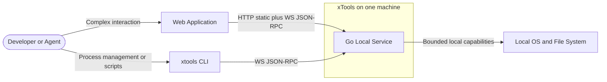

# 架构驱动力与系统上下文

> **按需读取**：确定产品范围、质量目标、部署拓扑或判断提案是否超出一期时读取。实现细节不在本文。
>
> **前置文档**：无。继续设计模块边界时读取 [02-microkernel-and-modules.md](02-microkernel-and-modules.md)。

## 1. 目标

xTools 以单个 CLI 二进制启动本地服务，由 Web 承载复杂交互。架构必须满足：

1. Go 与 Web 两侧的内核都只包含 runtime 机制，不包含具体业务、协议实现或业务界面。
2. 所有功能都以可独立装配、启停和测试的模块或插件存在，模块之间没有源码级横向依赖。
3. 新增普通能力、UI 工具、协议触达面或宿主时，不修改内核。
4. 契约、能力清单和导航等信息各自只有一个真源，其他表示均单向派生。
5. 安全控制必须准确描述其信任边界，不把声明、审计或故障隔离冒充恶意代码沙箱。
6. 一期保持单机、单用户、单 Go 服务进程；不为尚未出现的伸缩与隔离需求预付微服务成本。

## 2. 利益相关者与关注点

| 角色 | 主要关注点 | 本规格回应 |
|---|---|---|
| 最终用户 | 启动简单、功能可发现、失败可诊断、本机数据不被网页越权访问 | 单二进制、能力目录、显式不可用原因、连接准入与路径边界 |
| 功能开发者 | 新增工具不改内核、模块可独立测试、跨端契约不漂移 | 微内核、Capability、模块边界、单向 codegen |
| UI/插件开发者 | 宿主无关、贡献点稳定、插件失败不拖垮工作台 | IChannel、UI manifest、注册表、ErrorBoundary |
| 架构维护者 | 依赖方向可执行、模式不过度使用、演进路径清晰 | 架构不变式、静态守卫、模式准入门槛、决策触发器 |
| 安全评审者 | 主体不可伪造、边界描述真实、敏感数据不进日志 | 服务端 principal、Invoke 管线、可信插件声明、审计最小化 |

## 3. 一期范围

| 项 | 一期决定 |
|---|---|
| 入口 | 单个 xtools CLI；start / stop / status 管理服务 |
| 服务 | 一个 Go 进程，监听 127.0.0.1:10312；端口可配置 |
| 复杂 UI | Web 应用；React 19 + TanStack Router hash 模式 + Tailwind 4 |
| Web 工程 | pnpm workspace 管依赖；Turborepo 管任务图与缓存 |
| Go 工程 | 多个 go.mod 对齐模块边界；根 go.work 负责仓库内联合开发 |
| 主调用通道 | WebSocket 上的 JSON-RPC |
| HTTP | 静态资源、健康检查和少量无状态请求 |
| 契约真源 | Go capability 输入/输出 struct |
| 外部插件 | 用户从本地目录安装的可信 UI 代码；只消费后端 capability |
| 后端扩展 | 仅允许编译进二进制的内置 Go 模块提供 capability |
| 动态性 | 启动/首帧前注册，随后 freeze；不热插拔 |
| 网络边界 | 仅 loopback；不支持局域网或远程访问 |

## 4. 非目标

一期不提供：外部插件后端代码、进程内脚本沙箱、远程插件安装、插件签名、后台守护、配置热重载、自定义域名、MCP、微服务拆分、事件持久化/重放，以及插件热插拔。

## 5. 质量属性场景

| 属性 | 可验证场景 |
|---|---|
| 可修改性 | 新增普通 Go capability 与对应 UI 工具时，内核源码零修改；只新增模块、契约和宿主装配声明 |
| 模块独立性 | 任一模块的实现包可被替换或禁用；其他业务模块不因源码 import 而需要同步修改 |
| 可移植性 | 新增宿主只实现 channel adapter 与 composition root；业务插件和视图零修改 |
| 可靠性 | 单次 handler panic 只失败该调用；单个 UI 插件失败只降级自身；服务不会以残缺注册表启动 |
| 一致性 | 各触达面由同一冻结快照派生；生成契约与 Go 真源无差异 |
| 安全性 | 非法输入、未授权调用和不合格连接在 handler 前被拒绝；审计不记录业务 payload |
| 性能 | 建立启动时间、Web 首屏、调用延迟和内存基线；未测量前不承诺具体数字、不预设复杂缓存 |

## 6. 运行拓扑

[Mermaid 源文件](diagrams/01-system-context.mmd)

Web 与 CLI 都是无特权客户端；Go 服务是有状态能力的唯一运行位置和状态真源。CLI 能力命令不得在另一个进程内隐式运行第二份服务内核。
