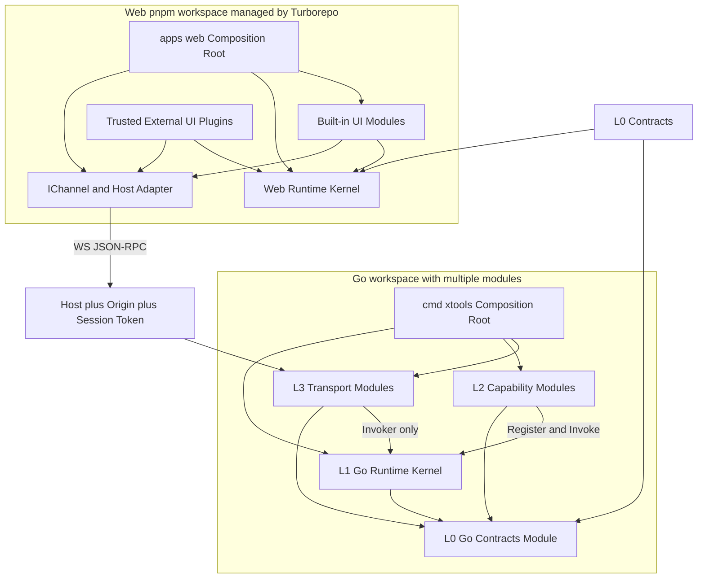
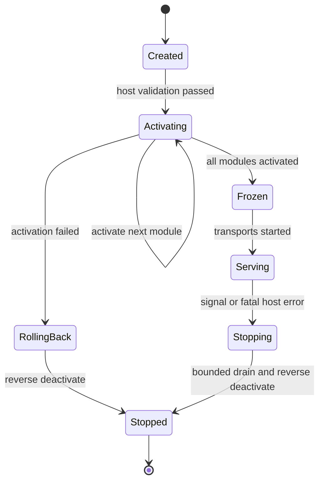

# 双侧微内核与模块生命周期

> **按需读取**：设计或评审 kernel、模块边界、依赖方向、宿主装配和启停行为时读取。
>
> **前置文档**：[01-drivers-and-context.md](01-drivers-and-context.md)。通信与调用细节见 [03-capability-runtime.md](03-capability-runtime.md)。

## 1. 双侧 runtime-only kernel

### 1.1 Go runtime kernel

Go 内核必须且只能承担五类 runtime 职责：生命周期编排、贡献注册表及只读快照、仅面向技术服务的类型化 DI、进程内事件总线、统一的 capability Invoke 管线。

HTTP、WebSocket、MCP、文件、Shell、存储、插件目录等均不属于内核。

### 1.2 Web runtime kernel

Web 内核必须且只能承担五类 runtime 职责：生成契约的装载与运行时校验、UI 贡献注册表、技术服务 DI、与宿主无关的 IChannel 端口、UI 模块生命周期与故障隔离。

导航骨架、工具大全、命令面板、设置页和具体工具均为 UI 模块，不属于 Web 内核。

### 1.3 逻辑架构

[Mermaid 源文件](diagrams/02-logical-architecture.mmd)

## 2. 分层与依赖规则

| 层 | 内容 | 允许依赖 |
|---|---|---|
| L0 Contracts | schema、capability ID、类型化 service token、错误码 | 无 |
| L1 Kernel | 五类 runtime 机制 | L0 |
| L2 Capability Modules | fs、shell、storage、catalog、pluginhost 等 | L1、L0 |
| L3 Transport Modules | http、ws、未来 mcp | L1、L0 |
| Host Composition | 配置、模块选择、必需模块校验和进程入口 | L3、L2、L1、L0 |

每一行在 Go 侧对应独立 go.mod：go/contracts、go/kernel、每个 go/modules/*、每个 go/transports/* 以及 cmd/xtools。根 go.work 只负责联合开发，不改变上表依赖方向。

依赖必须单向朝内。Kernel MUST NOT import module、transport 或 host；同层业务模块 MUST NOT 横向 import。L2 与 L3 的区分表达角色，不赋予特权。

Web 侧等价规则是：runtime 不 import 具体 UI 模块；UI 插件之间不直接 import；宿主判断只允许出现在 adapter 与 composition root。

## 3. Host Composition Root

内核不知道任何具体模块名，也没有“必需模块”概念。每种宿主在内核外的 composition root 中读取并验证配置、选择模块集合、声明并验证 required module IDs、构造 kernel 和模块，最后启动生命周期。

Web 服务宿主通常要求 HTTP、WS、静态资源及其准入控制均已装配。具体 required IDs 由宿主配置定义，不写入 ModuleManifest。缺少必需模块必须在激活前失败，不得隐式补装或静默降级。

“required”只是部署完整性约束：不赋予模块内核身份、不放宽授权，也不允许横向 import。

## 4. 模块契约

    type Module interface {
        Manifest() ModuleManifest
        Activate(ActivationContext) error
        Deactivate(context.Context) error
    }

    type ModuleManifest struct {
        ID        string
        DependsOn []string
        Provides  []ServiceToken
    }

DependsOn 只决定激活与停机顺序。它不是授权声明，不允许模块 import 其依赖模块。Provides 只允许列出经架构批准的技术 service token。

Web UI 模块采用对称的 manifest / activate / deactivate 生命周期。两侧内置模块都走常规注册与生命周期路径，不得通过包级 init() 偷偷注册。

## 5. ActivationContext

ActivationContext 是模块唯一的 runtime facade，可以提供：贡献注册入口、技术服务 DI、已绑定身份的 CapabilityClient、EventBus、只读配置与模块 logger。它不得暴露 handler、绕过 Invoke 的入口、内核可变状态、其他业务模块实例或 freeze 后的注册表写权限。

接口只为实际存在的贡献类型增加方法，不预先建立万能扩展点。

## 6. 生命周期状态机

Kernel 与模块至少具有 Created → Activating → Frozen → Serving → Stopping → Stopped 状态。非法状态转换必须拒绝并可测试。

[Mermaid 源文件](diagrams/03-lifecycle-state.mmd)

    读取配置
    → Host 选择模块并校验 required IDs
    → 校验 module ID / service token / capability ID 唯一性
    → 解析生命周期依赖并检测环
    → 拓扑序 Activate
    → freeze 所有注册表并生成只读快照
    → transport 从同一快照派生触达面
    → Serving

内置 Go 模块激活失败时，内核必须逆序停用已激活模块并退出，不得带残缺注册表启动。

停机顺序：停止接受新调用 → 在有界预算内等待在途调用 → 逆拓扑 Deactivate → 释放 listener、锁文件和其他资源。超时后记录诊断并退出，不无限等待。

## 7. 故障语义

| 故障点 | 必须行为 | 禁止行为 |
|---|---|---|
| Host 必需模块缺失 | 激活前失败并列出缺失 ID | 构造残缺 kernel、隐式补装 |
| 内置 Go 模块激活失败 | 逆序回滚已激活模块并退出 | 跳过后继续 Serving |
| UI 插件激活或加载失败 | 移除其未完成贡献、降级自身并记录诊断 | 使工作台或其他插件白屏 |
| Filter 或 handler panic | recover 为稳定错误并保留 trace ID | 终止进程、返回内部堆栈或 payload |
| Event 订阅者过慢 | 丢最旧、报告 overflow、由消费者重查 | 阻塞发布者或无限扩容队列 |
| 停机超时 | 记录未完成项后结束进程 | 无限等待 |
