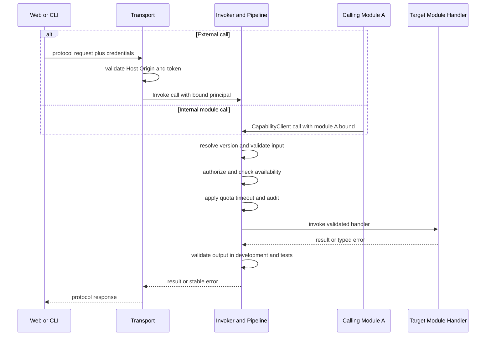

# Capability 运行时与通信语义

> **按需读取**：新增/评审 capability、模块协作、Invoke 管线、事件或契约生成时读取。
>
> **前置文档**：[02-microkernel-and-modules.md](02-microkernel-and-modules.md)。安全主体与入口准入见 [05-plugins-and-security.md](05-plugins-and-security.md)。

## 1. 三种跨模块通信语义

三种通道各司其职，禁止按方便程度随意替换：

| 通道 | 允许用途 | 禁止用途 |
|---|---|---|
| Capability | 需要结果、失败、权限、超时或审计的同步业务命令/查询 | 绕过 Invoke 直接调 handler |
| Technical DI | Logger、Clock、ConfigReader、HTTP mux 等同宿主 runtime/技术协作 | 获取另一个业务模块或其 repository/service 来完成业务调用 |
| Event | 已经发生、无返回、允许丢失的事实通知 | 命令、查询、事务协调、状态真源、必须送达消息 |

模块 A 调用模块 B 的 capability 时，必须使用内核创建的 CapabilityClient。该客户端把 module:A 主体绑定到调用，再进入与外部请求相同的 Invoker；模块不得自报或改写身份。

## 2. 注册表与派生触达面

Capability 注册表是服务触达面的唯一真源：

    Frozen CapabilityRegistry
    ├─ WS JSON-RPC 方法表
    ├─ 少量 HTTP 端点
    ├─ CLI 能力命令树
    └─ 未来 MCP tool 清单

Transport 只能读取 RegistrySnapshot 并调用 Invoker，不得持有 handler 或注册表写接口。新增 transport 等于新增一个 adapter 模块；内核零修改。

## 3. Capability 契约

每个 capability 至少声明：稳定 ID、主版本、输入/输出 schema、授权策略、触达面、限制、可用性与 handler。示意：

    type Capability struct {
        ID          CapabilityID
        Major       uint
        Input       Schema
        Output      Schema
        Permissions []Permission
        Exposure    Exposure
        Limits      Limits
        Available   Availability
        Handler     Handler
    }

fs.read 等价于 fs.read@1。增加兼容的可选字段可保留主版本；删除字段、改变既有语义或增加必填字段必须发布新主版本。旧版下线前应当公开 deprecated 与 sunset 信息。

环境不支持的能力仍保留在清单中并返回结构化不可用原因；不得静默消失或降级为不同语义。限制必须结构化表达，不使用无约束 map[string]any 作为正式契约。

Capability 必须额外声明调用语义：命令或查询、是否幂等、是否支持取消、默认 deadline 和输入/输出大小限制。订阅型能力还必须声明事件 ID 与 overflow 后的重同步 capability。内核不根据命名猜测这些语义。

## 4. Invoke 管线

所有外部调用和模块间同步业务调用必须经过唯一管线：

[Mermaid 源文件](diagrams/04-invoke-sequence.mmd)

    recover / trace / deadline
    → 绑定服务端确立的 principal
    → capability 与版本解析
    → input schema 校验
    → authorization
    → availability
    → quota / timeout
    → audit metadata
    → handler
    → output schema 校验（开发/测试必须，生产策略由性能测量决定）

内核固定步骤顺序。扩展过滤器只能挂到有限、具名锚点；过滤器只能拒绝或增加只读上下文，不得改写已校验业务输入、改变 principal、跳过后续内置步骤或取得 handler。过滤器错误、panic 和超时全部 fail-closed。

审计只记录 capability ID、主体、trace ID、耗时与结果码，不记录文件内容、命令参数等 payload。

## 5. EventBus 语义

EventBus 只用于进程内事实通知：每个订阅者有有界队列，发布者不因慢订阅者阻塞。队列满时丢弃最旧项、累计 dropped 数，并发出 overflow 通知；消费者收到 overflow 后通过 capability 重查状态。

事件至多一次、可丢失、无持久化、无重放、无跨进程保证。订阅者 panic 被隔离、记录并摘除。需要顺序、返回值、重试或必须送达时，必须使用 capability 或未来专门设计的可靠消息机制。

订阅由服务端生成不可伪造的 subscription ID，并绑定连接、principal 与 capability。连接关闭、取消或模块停用时必须释放订阅；同一连接的订阅数受资源预算限制。服务端推送沿用原 capability 的授权边界，客户端不得通过自报 event ID 订阅未授权流。

## 6. 契约生成管线

Go 输入/输出 struct 是 schema 唯一真源：

    Go struct + validation tags
    → JSON Schema（构建期生成物）
    → Go 运行时校验数据
    └→ TypeScript types + Zod/Ajv validator

生成单向进行，不允许 TS 回写 Go，不引入中立 IDL。生成物按 capability 主版本组织并提交仓库；CI 重新生成后必须无 diff。Web 前置校验只改善 UX，Go Invoke 校验才是安全边界。

生成必须可复现：固定生成工具版本、对 schema 条目进行确定性排序、在生成物中记录来源和禁止手改标记。构建不得依赖开发机上的隐式全局工具。
