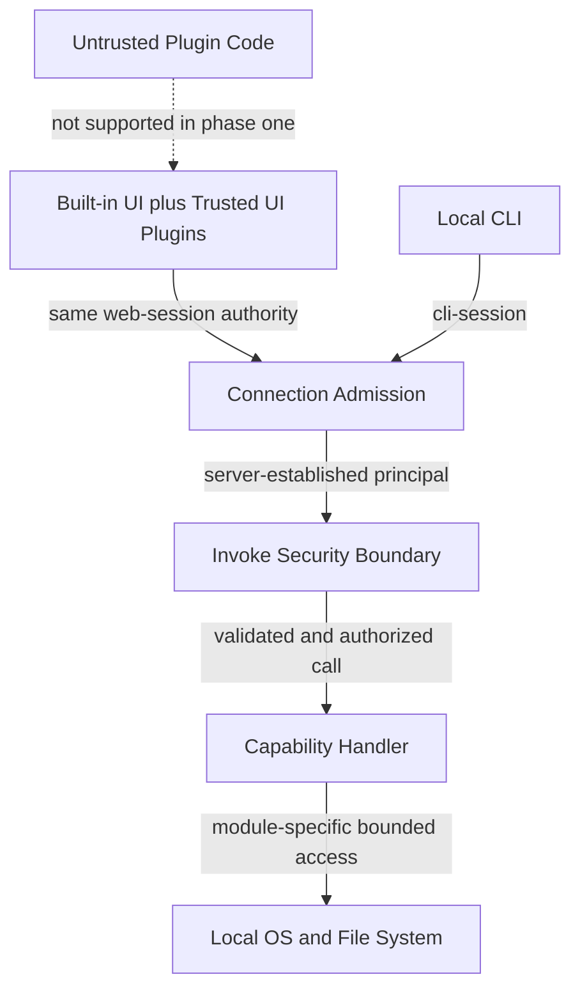

# 插件信任与安全边界

> **按需读取**：处理外部插件、Principal、授权、HTTP/WS 准入、文件或 Shell 能力时必须读取。
>
> **前置文档**：[03-capability-runtime.md](03-capability-runtime.md)。验证要求见 [06-invariants-and-verification.md](06-invariants-and-verification.md)。

## 1. 内置模块与外部插件

两者共享贡献思想和生命周期形状，但能力与信任不同：

| | 内置 Go/UI 模块 | 外部 UI 插件（一期） |
|---|---|---|
| 来源 | 随 xTools 构建和发布 | 用户从本地目录主动安装 |
| 后端 capability | 可提供 | 不可提供 |
| 执行位置 | Go 进程或 Web 主上下文 | Web 主 JavaScript 上下文 |
| 信任 | 产品发布代码 | 用户选择信任的代码 |
| 隔离目标 | 模块边界与故障隔离 | 故障隔离；不是恶意代码隔离 |

一期外部 UI 插件能读取页面可见数据、访问同上下文对象并绕过客户端包装。文档、UI 和代码注释 MUST NOT 把 requires、scopedChannel 或 ErrorBoundary 描述成恶意代码隔离；它们分别只承担依赖声明、调用侧能力收窄和故障隔离。

## 2. 外部 UI 插件 manifest

manifest 至少包含 ID、版本、xTools engine 范围、runtimes = [ui]、所需 capability 及 UI 贡献物。UI 贡献可以声明 ViewContainer、View、结构化导航、命令、区域 renderer 及其拥有的子 Slot；引用其他插件容器时只记录稳定 ID，不声明实现依赖。未知字段可以忽略以便前向兼容；关键字段缺失、ID 冲突、engine 不兼容或 entry 越出插件根目录时拒绝加载并报告原因。

```toml
id = "com.example.hash-tool"
name = "Hash Tool"
version = "0.1.0"
runtimes = ["ui"]
requires = ["fs.read@1", "storage.get@1"]

[engines]
xtools = "^1"

[[contributes.viewContainers]]
id = "hash"
title = "Hash"
order = 30

[[contributes.views]]
containerId = "hash"
id = "hash.main"
slot = "content"
entry = "ui/index.js"
```

requires 的作用仅是依赖声明、兼容性检查、能力发现、UX 置灰与审计提示。它不是服务端可证明的插件级授权，因为同一页面上下文不能可靠判断一次调用来自哪个插件。

区域 renderer、类型化 Slot、受限输入和 ErrorBoundary 只提供组合约束与故障隔离。renderer 即使只收到收窄 props，仍运行在同一页面上下文；文档、UI 和注释不得把该收窄描述为恶意代码隔离或服务端插件级授权。

插件发现必须确定性执行：按规范化插件 ID 排序后校验和加载；外部插件不得占用内置 ID；任意重复 ID 都拒绝相关外部插件并报告冲突来源，不采用“最后一个覆盖”。entry 与资源路径必须解析后仍位于该插件根目录。

## 3. Principal 与授权

服务端只信任自己能够确立的主体：



[Mermaid 源文件](diagrams/05-trust-boundaries.mmd)

- web-session：整个浏览器页面连接；内置 UI 与外部 UI 插件无法安全区分；
- cli-session：通过本机凭证连接的 CLI；
- module:id：由内核创建的 CapabilityClient 固定绑定的 Go 模块；
- 未来隔离进程主体：由独立进程通道建立。

浏览器请求中的 pluginId 只能作为不可信审计提示，不得参与服务端安全决策。任何不应被整个可信 Web 页面访问的特权 capability，都不得暴露给 web-session。内置 UI 与外部 UI 在一期无法形成不同的服务端权限等级。

## 4. 连接准入

服务只监听 loopback。所有客户端必须通过 Host 校验与每次启动轮换的 session token；浏览器请求还必须携带且通过 Origin allowlist。非浏览器 CLI 可以没有 Origin，但不能没有 token。

| 控制 | 规则 |
|---|---|
| Host | 只接受配置端口上的 127.0.0.1、localhost 和明确允许的 localhost 别名 |
| Origin | 浏览器 HTTP/WS 必须来自内置或追加 allowlist；不能使用通配符 |
| Token | 每次 start 轮换；保存为用户私有文件；不写日志、URL 或仓库 |
| Principal | 准入成功后由 transport/内核建立；请求 payload 不得自报身份 |

追加 Origin 会扩大攻击面，必须显式配置。连接准入不得提供总开关。Transport 负责协议握手，但只能产出受内核认可的连接信息；业务授权仍在 Invoke 管线完成。

Session token 文件必须以仅当前用户可读写的原子方式创建，每次 start 轮换；服务退出时尽力删除。静态页面不得把 token 放进 URL、持久化浏览器存储或可被第三方资源读取的位置。Web 页面不得加载第三方脚本；否则同页面可信边界失效。

## 5. 文件与命令能力

文件 capability 默认限制在配置的根目录内，并使用规范化后的真实路径判断边界，防止父目录与符号链接逃逸。

路径校验必须覆盖不存在目标的父目录解析与检查后使用前被替换的竞争条件。涉及写入/删除时应优先使用目录句柄相对操作或在打开后验证真实目标；仅做字符串前缀判断不合格。

Shell capability 必须结构化区分 executable 与 argv，禁止经字符串拼接隐式进入 shell；提权或无界文件访问不得暴露给 web-session。

命令执行默认不继承全部环境变量；环境、工作目录、最大输出、运行时长与进程树终止策略都必须显式受限。输出达到上限时返回可诊断的 resource_exhausted，而不是无限缓冲。

更细的能力安全策略属于对应模块契约，但不得绕过统一 schema、authorization、limit 和 audit 管线。

## 6. 后端插件演进边界

一期 Go 进程不加载外部后端代码。未来确有外部后端插件需求时，采用独立子进程及受限 RPC；不使用可逃逸的同进程脚本沙箱。

该阶段必须重新设计进程 principal、资源限制、安装信任、签名/来源及可靠消息语义，不能把一期 UI manifest 直接当作安全模型。
