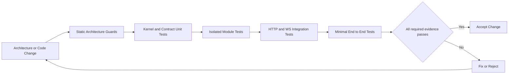

# 架构不变式与验证

> **按需读取**：任何实现、代码评审或架构变更都应读取。本文定义跨主题硬约束与最低证据。
>
> **前置文档**：先读取任务对应的主题文档；本文不重复各机制的详细设计。

## 1. 必须持续成立的不变式

1. **Runtime-only kernel**：Go/Web 内核无业务、具体协议实现、界面和具体模块名。
2. **单向依赖**：依赖朝 L0/L1；kernel 不依赖外层。
3. **模块零横向 import**：Go 与 Web 业务模块不得直接依赖另一个模块实现或公开 API 包。
4. **同步业务调用只有 capability**：外部与内部调用均经过同一 Invoker/Invoke 管线。
5. **DI 仅技术服务**：DI 不得成为业务调用后门。
6. **Event 仅事实通知**：可丢、无返回、非状态真源。
7. **Host 决定必需模块**：kernel 与 manifest 不硬编码宿主必需性。
8. **触达面单一真源**：所有方法、命令和 tool 清单从同一冻结注册表派生。
9. **Schema 单一真源**：Go struct 单向生成 JSON Schema 与 Web 契约。
10. **UI 宿主无关**：UI 业务只依赖 IChannel，不识别宿主与协议。
11. **身份不可自报**：安全 principal 由连接或内核创建的客户端绑定。
12. **插件信任描述真实**：一期外部 UI 插件是可信同上下文代码，客户端 scope 不是恶意代码隔离。
13. **Fail-closed**：准入、校验、授权、过滤器和激活失败不放行残缺状态。
14. **能力边界显式**：不可用、版本和 limits 可查询，不静默降级。
15. **Workspace 边界对齐架构**：pnpm package 与 Go module 只沿允许方向依赖；composition roots 是唯一聚合实现的位置。
16. **所有者声明类型化 Slot**：runtime 只内建 `root`；子 Slot 由父贡献所有者声明和渲染，贡献归属插件生命周期，注册表首帧前 freeze。
17. **renderer 显式绑定**：每个区域使用独立契约，按 Shell、容器、用户全局和工作区层解析；显式无效引用不得静默回退或由加载顺序覆盖。

## 2. 自动化守卫

| 约束 | 最低验证方式 |
|---|---|
| Kernel 无业务/协议 | import allowlist + 禁止依赖 module/transport/React/router/HTTP/WS 实现 |
| 分层与横向隔离 | Go import graph/depguard；Web ESLint boundaries/no-restricted-imports |
| DI 仅技术服务 | service token 定义集中在 L0，新增 token 需架构评审；禁止 token 返回业务模块类型 |
| Invoke 唯一路径 | transport 与 module 包无法引用 Handler；组件测试验证内外调用经过相同 filters |
| Registry freeze | 状态机与并发单测；freeze 后注册失败 |
| 契约无漂移 | codegen 后 working tree 无 diff |
| UI 宿主无关 | 禁止直接 import transport 与宿主全局变量；adapter 契约测试 |
| 连接安全 | Host、Origin、token 分别缺失/伪造测试；CLI 无 Origin + 有效 token 正向测试 |
| 事件有界 | 慢消费者、overflow、panic 隔离和状态重查测试 |
| 插件故障隔离 | activate、entry 加载和 render 三类失败均不影响其他插件 |
| 信任措辞 | 文档评审检查 scopedChannel/requires 未被描述为恶意代码隔离 |
| 目录与命名 | 检查目录层级、ID 格式、重复 ID 和禁止的 common/utils 业务包 |
| 协议一致性 | 同一 capability 的 WS/CLI 错误码和 schema 契约测试 |
| 资源有界 | deadline/取消传播、输入输出大小、并发、订阅与进程树终止测试 |
| Web workspace | pnpm workspace 图无环、workspace:* 无越层依赖；Turbo dry-run 任务图符合 codegen/build/test 顺序 |
| Go workspace | go.work use 清单完整；workspace 全测 + 每个 module 在 GOWORK=off 下 tidy/check/test |
| root 与 Slot 所有权 | Task 4 `slot-registry.test.ts` 验证唯一 root、父所有者声明权、基数、生命周期级联和 freeze |
| renderer 绑定 | Task 5 `binding-resolver.test.ts` 验证四层优先级、区域/版本兼容和无效引用不回退 |
| URL 导航真源 | Task 7 `composition.test.tsx` 验证 hash URL 驱动容器/View，store 不保存 active route |
| UI 模块实现隔离 | Task 2 `web-boundaries.test.mjs` 解析 package graph 与 import，拒绝模块横向实现依赖 |
| 持久偏好边界 | Task 10 `preferences-controller.test.ts` 与架构守卫证明只经 IChannel，拒绝 localStorage |
| Shell Fail-closed | Task 7 `composition.test.tsx` 验证必需 Shell 失败只保留启动诊断页 |

简单 grep 可以作为补充诊断，但关键依赖规则应当由语法树或依赖图工具验证，避免注释、别名与生成代码造成误判。

## 3. 测试分层

[Mermaid 源文件](diagrams/06-verification-loop.mmd)

1. **静态架构测试**：依赖、包边界、生成物和禁用 API。
2. **单元测试**：registry、生命周期状态机、Invoke 各步骤、版本解析、event overflow。
3. **模块组件测试**：每个 capability 模块使用内存技术服务独立运行，无真实网络和 UI。
4. **集成测试**：真实 HTTP/WS 握手、准入、JSON-RPC、schema 与优雅停机。
5. **少量 E2E**：CLI 启动服务、Web 完成一次调用、UI 插件失败降级。

发布前至少证明：新增模块不改 kernel、所有架构守卫通过、契约生成无差异、负向准入测试通过、单个 handler/UI 插件故障不扩散。

## 4. 需求到证据的追踪

新增或修改任何 MUST/MUST NOT 时，必须在同一变更中指定自动化测试、静态守卫或人工评审证据；没有可执行证据的硬约束不能只停留在正文。架构测试应输出违反规则的源文件、依赖边和对应不变式编号，便于修复。

代码评审说明至少列出受影响的不变式、运行时场景与验证命令。若因项目尚未落地而无法自动验证，必须创建明确的实现验收项，而不是把“后续补测试”作为完成状态。
